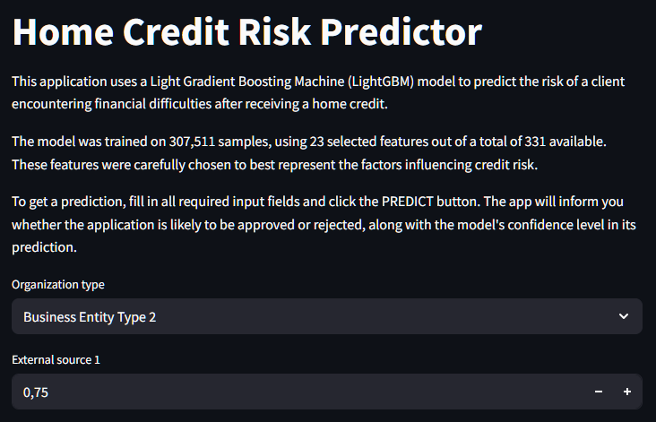
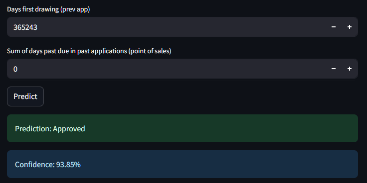

# Credit Risk Predictor Project

## Overview

This project provides a machine learning solution for predicting the risk of home credit default, designed as a proof-of-concept for a "risk evaluation as a service" startup. The solution uses the [Home Credit Default Risk dataset](https://www.kaggle.com/competitions/home-credit-default-risk/data) from Kaggle and demonstrates the full workflow: data analysis, feature engineering, model selection, evaluation, and deployment.

## Motivation

Home ownership is often out of reach for many, especially young people, due to high property prices. Home credits (mortgages) provide an opportunity, but incorrect lending decisions can lead to significant risks. This project seeks to build a model that predicts the likelihood of a client defaulting, enabling safer lending and potentially lowering credit costs.

## Project Structure

- **I_EDA.ipynb**: Exploratory Data Analysis, feature engineering, and feature selection using LightGBM feature importance.
- **II_ML_modeling&deployment.ipynb**: Model training, evaluation, hyperparameter tuning, and deployment steps.
- **app.py**: Streamlit application for interactive credit risk prediction.
- **model_file.pkl**: Trained LightGBM model.
- **final_df_analysis_report.html**: Automated EDA report from Sweetviz.
- **submission.csv**: Results submitted to Kaggle.
- **requirements.txt**: Python dependencies.
- **Dockerfile**: For containerizing the app for deployment.
- **data/**: Directory for raw and processed data files (not included).

## Data

The project uses multiple files from the Home Credit dataset, including:
- `application_train.csv`, `application_test.csv`
- `bureau.csv`, `bureau_balance.csv`
- `previous_application.csv`
- `credit_card_balance.csv`
- `installments_payments.csv`
- `POS_CASH_balance.csv`
- `HomeCredit_columns_description.csv`

## Workflow

1. **Data Preparation & EDA**
   - Data cleaning, handling missing values, and merging multiple sources.
   - Feature engineering and aggregation.
   - Feature selection using LightGBM feature importance.

2. **Modeling**
   - Multiple models evaluated: DummyClassifier, Logistic Regression, Decision Tree, Random Forest, XGBoost, LightGBM, and ensemble methods.
   - Special attention to class imbalance using undersampling, SMOTE, and balanced classifiers.
   - Hyperparameter tuning with Optuna.

3. **Evaluation**
   - Metrics: Balanced accuracy, ROC AUC, F1 score, Recall.
   - Validation on hold-out set and Kaggle submission.
   - Final ROC AUC on Kaggle: **0.74955**.

4. **Deployment**
   - Model saved as `model_file.pkl`.
   - Streamlit app (`app.py`) for user-friendly predictions.
   - Dockerized and deployed to Google Cloud Run.
   - Example deployment: [Home Credit Risk Predictor web app](https://credit-risk-predictor-450359247412.europe-central2.run.app/).
   Screenshots from the POC web app:
   
   

## How to Run

1. **Clone the repository:**
    ```bash
    git clone https://github.com/janklaszczyk/home-credit-risk-prediction-app.git
    ```

2. **Install dependencies:**
    ```bash
    pip install -r requirements.txt
    ```

3. **Download the data:**
    - Place your Kaggle API credentials in `kaggle.json` or set them as environment variables.
    - Download and unzip the datasets from the [Kaggle competition page](https://www.kaggle.com/competitions/home-credit-default-risk/data).

4. **Run EDA and Modeling Notebooks:**
    - Open `I_EDA.ipynb` for exploratory data analysis and feature engineering.
    - Open `II_ML_modeling&deployment.ipynb` for model training, evaluation, and deployment.

### Deployment

The final model and app are designed to be deployed on Google Cloud Platform using Streamlit. See instructions in `II_ML_modeling&deployment.ipynb` and `app.py`.
## Results

- **Feature Importance:** Top features include `ORGANIZATION_TYPE`, `EXT_SOURCE_1/2/3`, `DAYS_BIRTH`, and `AMT_CREDIT`.
- **Insights:** Certain organization types and younger applicants are at higher risk of default.
- **Model Performance:** (0,77 AUC)

## References

- Home Credit Default Risk. [Kaggle Competition](https://kaggle.com/competitions/home-credit-default-risk), 2018.

## License

This project is for educational purposes.
